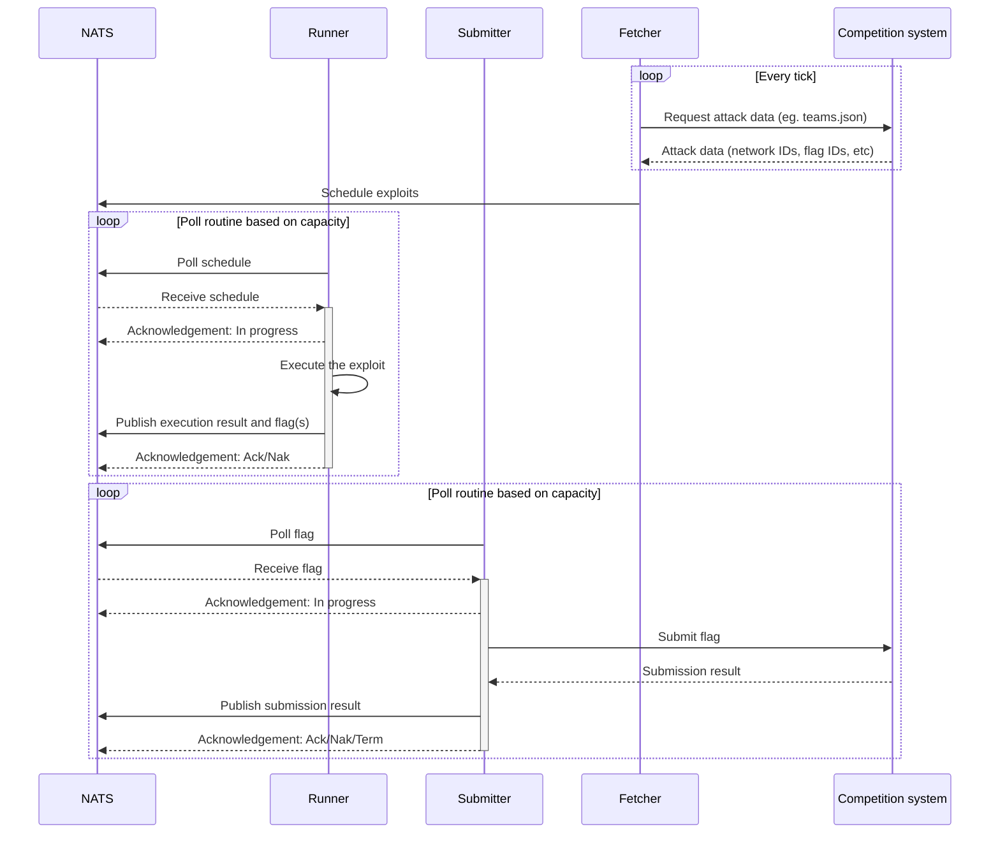

# kriger

An exploit farm for attack/defense (A/D) CTFs. This is the next-generation exploit farm based on the work done
in [angrepa](https://github.com/Cyberlandslaget/angrepa).


## Components

- **kriger**: A meta-package containing all server components.
    - **kriger-controller**: Responsible for scheduling exploit runs and provisioning compute for the exploit runners.
    - **kriger-fetcher**: Responsible for fetching various data from the competition system, for example teams.json. The
      fetcher will also persist the received data.
    - **kriger-metrics**: [OpenMetrics](https://openmetrics.io/)/[Prometheus](https://prometheus.io/)-compatible
    - **kriger-rest**: REST API for the CLI and the web frontend.
    - **kriger-runner**: Responsible for executing the exploits.
    - **kriger-submitter**: Responsible for submitting flags to the competition system.
      metrics exporter.
    - **kriger-ws**: WebSocket server to send real-time data to the web frontend or other consumers.
- **kriger-cli**: The command line interface (CLI) used to create, test, and deploy exploits.

All server components can be packaged and shipped as a single binary. All server components except `kriger-runner` can
be all be run in a single instance.

### Component topology

**Server components**:

| Component             | Requirements             | Replicas                 |
|-----------------------|--------------------------|--------------------------|
| **kriger-controller** | Nats, Kubernetes API     | Exactly one              |
| **kriger-fetcher**    | Nats, Competition system | Exactly one              |                 
| **kriger-metrics**    | Nats                     | At least one / any       |                 
| **kriger-rest**       | Nats                     | At least one / any       |
| **kriger-runner**     | Nats, Competition system | At least one per exploit |                 
| **kriger-submitter**  | Nats, Competition system | At least one             |                 
| **kriger-ws**         | Nats                     | At least one / any       | 

**Client components**:

| Component           | Requirements           | Replicas |
|---------------------|------------------------|----------|
| **kriger-cli**      | kriger-rest, kriger-ws | Any      |                 
| **kriger-frontend** | kriger-rest, kriger-ws | Any      |                 

Replica counts marked with *any* means that the component is deemed to be non-critical for the exploit farm to function.

## Usage

### Installing the CLI

TODO

### Developing exploits

## Development

A Linux or macOS environment is **highly** recommended. Windows users should consider using WSL.

### Prerequisites

- Rust Toolchain (see [Install Rust](https://www.rust-lang.org/tools/install))
- [Docker](https://docs.docker.com/engine/install/) with [Compose v2](https://docs.docker.com/compose/install/) *(or
  other container runtimes with support for Docker Compose files)*

### Running required services

| Service | Port                    |
|---------|-------------------------|
| nats    | 4222 (NATS & JetStream) |

**Start services:**

```bash
docker compose up -d --remove-orphans
```

**Stop services:**

```bash
docker compose down
```

### Running kriger

```bash
cargo run
```

### Debugging

**Nats debugging:**

```bash
docker run --network kriger_default -e NATS_URL=nats://nats:4222 --rm -it natsio/nats-box
```

> **Note**: Check `docker network ls` if the network name of the Docker compose project is different from the provided
> command.

## Architecture

**Kriger**'s architecture heavily relies
on [NATS JetStreams](https://docs.nats.io/using-nats/developer/develop_jetstream)
to provide reliable and fault-tolerant asynchronous messaging. This enables **kriger** to be decoupled and increases its
quality of service. In short, we gain the following benefits:

- Components can function independently of one another. For example, if the *controller* goes down, most of the
  system will still function properly.
- Idempotency is provided
  with [message deduplication](https://docs.nats.io/using-nats/developer/develop_jetstream/model_deep_dive#message-deduplication).
  This means that every component can operate statelessly without having to worry about actions that have already been
  performed.
- [Message retention](https://docs.nats.io/using-nats/developer/develop_jetstream/model_deep_dive#stream-limits-retention-and-policy)
  can be controlled and handled automatically by NATS. This means that **kriger** does not need to worry about old
  exploit schedules or outdated data that are no longer relevant.
- [Exactly once](https://docs.nats.io/using-nats/developer/develop_jetstream/model_deep_dive#exactly-once-semantics)
  delivery allows for improved efficiency without sacrificing reliability. Automatic retries and redeliveries are
  included.
- [Consumers](https://docs.nats.io/using-nats/developer/develop_jetstream/consumers) allow for robust, scalable, and
  flexible workload distribution.
- ... and more!

### Diagrams

**Fetcher, exploit execution, and submission**:


