# Submitters

## Status

Draft

## Context

There are varying standards and protocols for how flags should be submitted during an attack/defense CTF contest.

Examples:

- **CINI (ECSC 2024)**'s flag submission service is an HTTP service that accepts a list of flags. At the time of
  writing, CINI's submitter limits the request body to 100 kB and has a rate limit of 15 requests per minute.
- **FAUST CTF**'s flag submission service accepts flag submissions via a raw TCP stream outlined in
  the [CTF Gameserver documentation](https://ctf-gameserver.org/submission/). The client may submit an arbitrary number
  of flags during a single connection.

## Decision

Submitter implementations should have the flexibility required while maintaining an efficient system.

## Consequences

The submitter trait should accept a vector of flags which are bound to be submitted in bulk. Regardless of whether the
flags can be submitted in a stream, it is most likely more efficient to submit in bulk. By submitting the flags in bulk,
the I/O round trip time is drastically reduced as the submitter does not have to wait for each response before
submitting the next flag. Submitters that support "streaming" should submit in bulk with a short interval, e.g. 1s. See
the figures below.

**Fig. 1**: Streaming flag submission.

```mermaid
gantt
    dateFormat ss
    axisFormat %S s
    tickInterval 1second
    Submit AAA...: 00, 1s
    Submit BBB...: 01, 2s
    Submit CCC...: 03, 1s
    Submit DDD...: 04, 1s
```

**Fig. 2**: Bulk flag submission.

```mermaid
gantt
    dateFormat ss
    axisFormat %S s
    tickInterval 1second
    Submit AAA...: 00, 1s
    Submit BBB...: 00, 2s
    Submit CCC...: 02, 1s
    Submit DDD...: 02, 1s
```

