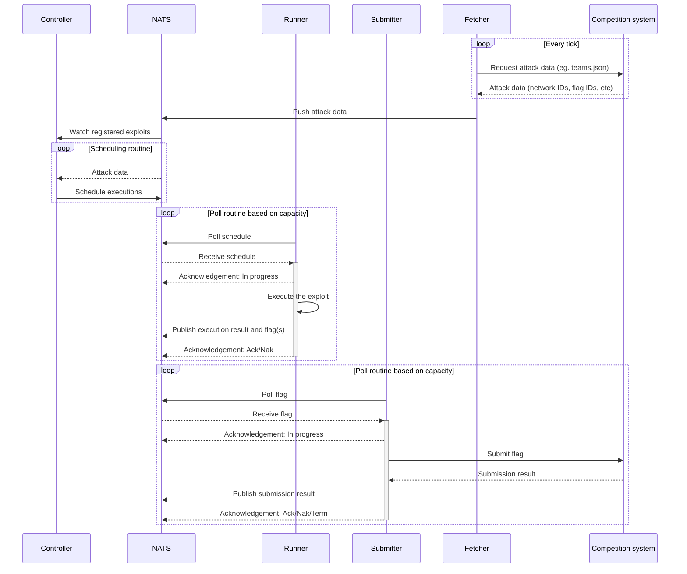

# Architecture

## Components

- **kriger-controller**: Responsible for provisioning compute for the exploit runners.
- **kriger-scheduler**: Responsible for scheduling exploit runs and timing the "ticks".
- **kriger-fetcher**: Responsible for fetching various data from the competition system, for example teams.json. The
  fetcher will also persist the received data.
- **kriger-metrics**: [OpenMetrics](https://openmetrics.io/)/[Prometheus](https://prometheus.io/)-compatible metrics
  exporter.
- **kriger-rest**: REST API for the CLI and the web frontend.
- **kriger-runner**: Responsible for executing the exploits.
- **kriger-submitter**: Responsible for submitting flags to the competition system.
  metrics exporter.
- **kriger-ws**: WebSocket server to send real-time data to the web frontend or other consumers.

- **kriger (bin)**: The binary containing the server components and the CLI. The command line interface (CLI) is used to
  create, test, and deploy exploits.

All server components can be packaged and shipped as a single binary. All server components except `kriger-runner` can
be run in a single instance.

### Component topology

**Server components**:

| Component             | Requirements             | Replicas                 |
|-----------------------|--------------------------|--------------------------|
| **kriger-controller** | Nats, Kubernetes API     | Exactly one              |
| **kriger-scheduler**  | Nats                     | Exactly one              |
| **kriger-fetcher**    | Nats, Competition system | Exactly one              |                 
| **kriger-metrics**    | Nats                     | At least one / any       |                 
| **kriger-rest**       | Nats                     | At least one / any       |
| **kriger-runner**     | Nats, Competition system | At least one per exploit |                 
| **kriger-submitter**  | Nats, Competition system | At least one             |                 
| **kriger-ws**         | Nats                     | At least one / any       | 

**Client components**:

| Component           | Requirements           | Replicas |
|---------------------|------------------------|----------|
| **kriger-cli**      | kriger-rest, kriger-ws | Any      |                 
| **kriger-frontend** | kriger-rest, kriger-ws | Any      |                 

Replica counts marked with *any* means that the component is deemed to be non-critical for the exploit farm to function.

## Architecture Deep Dive

**Kriger**'s architecture heavily relies
on [NATS JetStream](https://docs.nats.io/using-nats/developer/develop_jetstream)
to provide reliable and fault-tolerant asynchronous messaging. This enables **kriger** to be decoupled and increases its
quality of service. In short, we gain the following benefits:

- Components can function independently of one another. For example, if the *controller* goes down, most of the
  system will still function properly.
- Idempotency is provided
  with [message deduplication](https://docs.nats.io/using-nats/developer/develop_jetstream/model_deep_dive#message-deduplication).
  This means that every component can operate statelessly without having to worry about actions that have already been
  performed.
- [Message retention](https://docs.nats.io/using-nats/developer/develop_jetstream/model_deep_dive#stream-limits-retention-and-policy)
  can be controlled and handled automatically by NATS. This means that **kriger** does not need to worry about old
  exploit schedules or outdated data that are no longer relevant.
- [Exactly once](https://docs.nats.io/using-nats/developer/develop_jetstream/model_deep_dive#exactly-once-semantics)
  delivery allows for improved efficiency without sacrificing reliability. Automatic retries and redeliveries are
  included.
- [Consumers](https://docs.nats.io/using-nats/developer/develop_jetstream/consumers) allow for robust, scalable, and
  flexible workload distribution.
- ... and more!

### JetStream streams & K/V buckets

The *metrics* component is not explicitly listed as a consumer, but it'll consume most messages and key/value streams.

**Streams:**

| Stream     | Subject                            | Description                              | Producer  | Consumer(s) |
|------------|------------------------------------|------------------------------------------|-----------|-------------|
| executions | executions.{exploit name}.request  | Requests an execution of an exploit      | scheduler | runner      |      
| executions | executions.{exploit name}.complete | Signifies the completion of an execution | runner    |             |

**Key/Value:**

| Bucket   | Key           | Description                                       | Data owner / data handling pattern                  | Consumer (s) |
|----------|---------------|---------------------------------------------------|-----------------------------------------------------|--------------|
| exploits | {name}        | Exploit manifests                                 | rest. Optimistic concurrency control.               | controller   |   
| flags    | {flag}.submit | Flags submitted by exploits or manually submitted | rest, runner, rest. Optimistic concurrency control. | submitter    | 
| flags    | {flag}.result | Flag submission results                           | Submitter                                           |              | 

*\*Base64 encoding is used for segments with unpredictable names.*

> **Note**: Subject to change.

### Diagrams

**Fetcher, exploit execution, and submission**:

