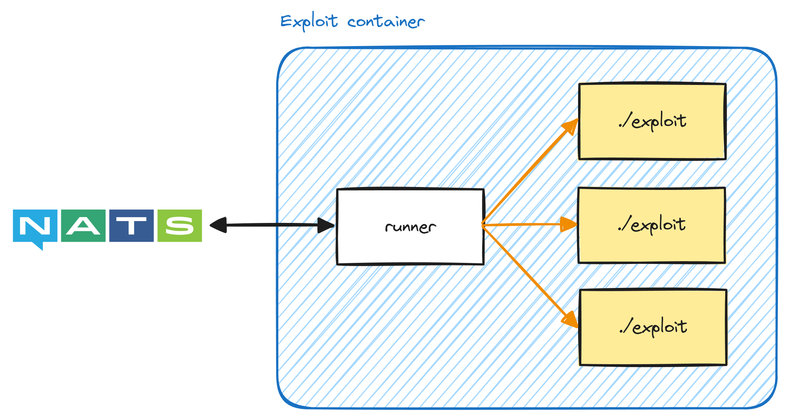

# Exploits

## Writing Exploits

### Python

TBD

### Other

The simplest way to write an exploit in other languages/frameworks/tools would be to use
the [simple exploit](#simple-exploits) execution mode.

The following Python code is provided for reference:

```python
import json
import os

ip = os.getenv("IP")
hint = json.loads(os.getenv("HINT"))

# ... Logic here

print("FLAG_ABCDEF123456")
```

## Anatomy of an Exploit

In short, each exploit is expected to be run as a command. Each exploit can be a self-contained binary, a script written
in an interpreted language, an automated playbook, etc.

Exploits are packaged as a [container image](https://github.com/opencontainers/image-spec/blob/main/spec.md) along with
the [runner](../crates/kriger_runner) binary. Base images and templates will be provided for common languages and
platforms. Many of the details mentioned here will be abstracted away in the template for the ease of development.

Exploits exiting with a non-zero [exit code](https://en.wikipedia.org/wiki/Exit_status) will be automatically retried.

## Execution Modes

### Simple Exploits

In simple exploits, each [runner](../crates/kriger_runner) will execute each execution as separate processes. The
exploit will receive its parameters and hints via environment variables. The exploit MUST print flags to
the [stdout](https://en.wikipedia.org/wiki/Standard_streams), terminated by a newline (`\n`) character.

The following environment variables are passed to exploits:

| Name      | Description                                                                            |
|-----------|----------------------------------------------------------------------------------------|
| `EXPLOIT` | The name fo the exploit.                                                               |
| `IP`      | The IP address of the target.                                                          |
| `HINT`    | Optional. JSON-serialized hint for the exploit to use, often referred to as "flag IDs" |



### Warmup-optimized Exploits

TBD

### Shared-runtime Exploits

TBD

## Architectural Decisions

- Containers are used to package exploits in a portable manner. Runtime dependencies, packages, custom binaries, etc.
  can be taken care of by the exploit author. This allows the exploits to be developed and deployed in the exact same
  way without *kriger* having to be responsible for package management, environment management, etc.
- Base images are used to cache common packages, tools, and image layers. This will reduce the image building time,
  making it even faster to write and deploy exploits.
- Running each execution separately reduces the risks of side effects causing instability or indeterministic executions.
  However, this approach is significantly slower than sharing a single runtime for multiple execution.
